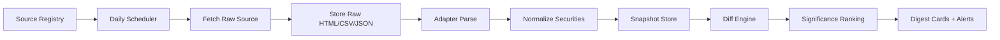

# 重要财经人物持仓变化功能设计

验证日期：2026-05-06

## 结论

这个功能应该设计成“每天检查重要投资人/机构是否出现新的持仓披露或可验证交易变化”，而不是承诺所有人物都有“每日真实持仓变化”。原因是不同人物的披露制度差异很大：

- Cathie Wood / ARK：可以做到交易日级别。ARK 官方每日发布 ETF 持仓文件，并提供交易通知；但官方也说明交易通知文件并不是完整交易清单，所以更稳的做法是抓每日持仓 CSV 后做前后日差分。
- 段永平：可通过 H&H International Investment, LLC 的 SEC 13F 做季度持仓变化。日更任务只能每天检查 SEC 是否有新文件，真实仓位不是每日披露。
- 但斌：可通过 Oriental Harbor Investment Master Fund 的 SEC 13F 做季度美股持仓变化；国内私募产品、A/H 股、ETF 十大持有人等多来自基金定期报告、媒体整理或数据库，不能当成每日完整仓位。

产品上建议把结果标成三类：`交易日披露`、`监管定期披露`、`公开表态/媒体线索`。展示时必须带来源、披露日期、报告期、置信度，避免把季度披露误读成当天交易。

## 数据源分层

| 层级 | 代表来源 | 更新频率 | 可做能力 | 风险 |
| --- | --- | --- | --- | --- |
| L1 交易日级 | ARK 官方 ETF holdings CSV、ARK trade notifications、CathiesArk 页面 | 交易日 | 日持仓快照、前后日差分、买入/卖出方向 | trade notification 不完整，需以 holdings diff 为准 |
| L2 监管披露 | SEC EDGAR 13F | 季度，通常披露滞后 | 机构季度仓位、季度增减仓、新进/清仓 | 13F 不覆盖全部资产类别，不代表完整组合 |
| L3 定期报告/媒体整理 | 基金年报/季报、ETF 十大持有人、私募排排网、基金媒体 | 周期不稳定 | 发现国内私募或产品持仓线索 | 授权、字段完整度、二手整理误差 |
| L4 社交媒体 | X、雪球、微博、公众号、访谈 | 不稳定 | 投资人观点、调仓解释、线索补充 | 不能直接等同持仓变化 |

## MVP 范围

第一版先做三个人物，但按“人物-载体-来源”建模：

1. Cathie Wood
   - 载体：ARKK、ARKQ、ARKW、ARKG、ARKF、ARKX。
   - 主来源：ARK 官方每日 ETF holdings CSV。
   - 辅来源：ARK trade notifications、CathiesArk combined trades 页面。
   - 输出：按 ticker 聚合的每日买入/卖出、各 ETF 内部变化、组合权重变化。

2. 段永平
   - 载体：H&H International Investment, LLC。
   - CIK：0001759760。
   - 主来源：SEC submissions API + 13F information table。
   - 输出：季度新进、增持、减持、清仓、持仓市值变化。

3. 但斌
   - 载体：Oriental Harbor Investment Master Fund，曾用名 Oriental Harbor Investment Fund。
   - CIK：0002046333。
   - 主来源：SEC submissions API + 13F information table。
   - 辅来源：中国基金报、私募排排网等报道，用于解释性摘要，不作为主数据。
   - 输出：季度美股持仓变化；国内持仓先只做线索卡片。

## 处理流程



关键实现原则：

- 每个 adapter 只产出标准化 observation，不直接写业务摘要。
- 原始文件必须落库或落对象存储，后续解析错误可以复算。
- diff 必须按 `vehicle_id + security_id + as_of_date` 做幂等，不能按抓取时间推断交易日。
- 同一人物可能有多个载体，人物页展示聚合，数据判断仍按载体分开。

## 标准事件模型

```json
{
  "investor_id": "cathie_wood",
  "vehicle_id": "arkk",
  "security": {
    "ticker": "TSLA",
    "name": "Tesla Inc",
    "cusip": "88160R101"
  },
  "event_type": "position_change",
  "direction": "sell",
  "as_of_date": "2026-05-05",
  "disclosed_at": "2026-05-06T06:05:39Z",
  "shares_delta": -13307,
  "market_value_delta": -5220000,
  "weight_pct_delta": -0.12,
  "confidence": "high",
  "source_tier": "L1",
  "evidence_url": "https://assets.ark-funds.com/fund-documents/funds-etf-csv/ARK_INNOVATION_ETF_ARKK_HOLDINGS.csv"
}
```

## 重要性排序

每条变化给一个 `significance_score`，建议由以下因素加权：

- 仓位变化幅度：`abs(shares_delta / previous_shares)`。
- 组合权重变化：`abs(weight_pct_delta)`。
- 资金规模：`abs(market_value_delta)`。
- 动作类型：清仓、新进 > 大幅增减 > 小幅再平衡。
- 人物权重：用户关注人物、历史命中率高的人物加权。
- 来源置信度：官方/监管 > 官方邮件 > 第三方页面 > 媒体/社交。
- 新鲜度：披露日越近权重越高，但报告期滞后要单独展示。

## 页面形态

首页可以做“今日重要调仓”信息流，每张卡片必须包含：

- 人物：Cathie Wood / 段永平 / 但斌。
- 载体：ARKK、H&H International Investment, LLC、Oriental Harbor Investment Master Fund。
- 动作：新进、增持、减持、清仓、持仓快照更新。
- 标的：ticker、公司名、市场。
- 变化：股数、权重、市值，缺失字段显示“未披露”。
- 披露语义：`报告期：2026 Q1`、`披露日：2026-04-28`、`抓取时间：...`。
- 来源：官方/监管/媒体链接。
- 风险标：`季度滞后`、`交易通知不完整`、`媒体线索`。

人物详情页建议分三栏：

- 持仓变化时间线。
- 当前可验证持仓快照。
- 相关解释/观点：只引用公开表态，独立于持仓数据。

## 调度策略

- ARK：美股交易日收盘后和次日清晨各检查一次，按 CSV `last-modified` 和内容 hash 去重。
- SEC 13F：每天检查重点 CIK 的 submissions JSON；季度窗口期（2/5/8/11 月中旬附近）提高检查频率。
- 国内/媒体线索：每天搜索或订阅指定 RSS/站内搜索结果，默认只生成待审核线索，不自动入“持仓变化”主表。

## 合规和产品文案边界

- 所有卡片都要写“披露变化”，不要写成“今天买入/卖出”，除非来源就是交易日级别且字段支持。
- 13F 必须显示报告期和披露日，因为它反映的是季度末持仓。
- 不做投资建议，不给“跟买/跟卖”按钮。
- 对第三方页面优先抓公开可访问数据；如需商业使用，优先找官方 API、授权或可缓存的数据协议。

## 参考来源

- ARK 官方 trade notifications：https://www.ark-funds.com/ark-trade-notifications
- ARK holdings 日期说明：https://helpcenter.ark-funds.com/can-you-explain-the-date-listed-on-the-ark-etf-holdings-documents
- ARK 调仓频率说明：https://helpcenter.ark-funds.com/how-often-is-the-portfolio-rebalanced
- CathiesArk combined trades：https://cathiesark.com/ark-funds-combined/trades
- SEC EDGAR API：https://www.sec.gov/edgar/sec-api-documentation
- SEC Form 13F FAQ：https://www.sec.gov/rules-regulations/staff-guidance/division-investment-management-frequently-asked-questions/frequently-asked-questions-about-form-13f
- H&H International Investment SEC submissions：https://data.sec.gov/submissions/CIK0001759760.json
- Oriental Harbor Investment Master Fund SEC submissions：https://data.sec.gov/submissions/CIK0002046333.json
